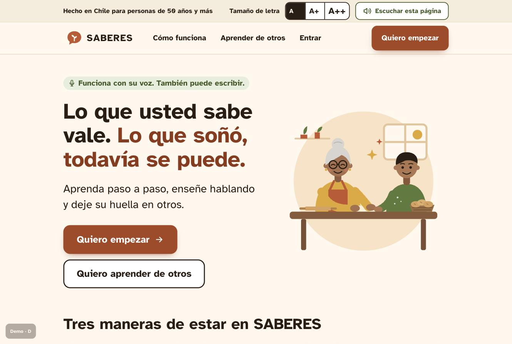
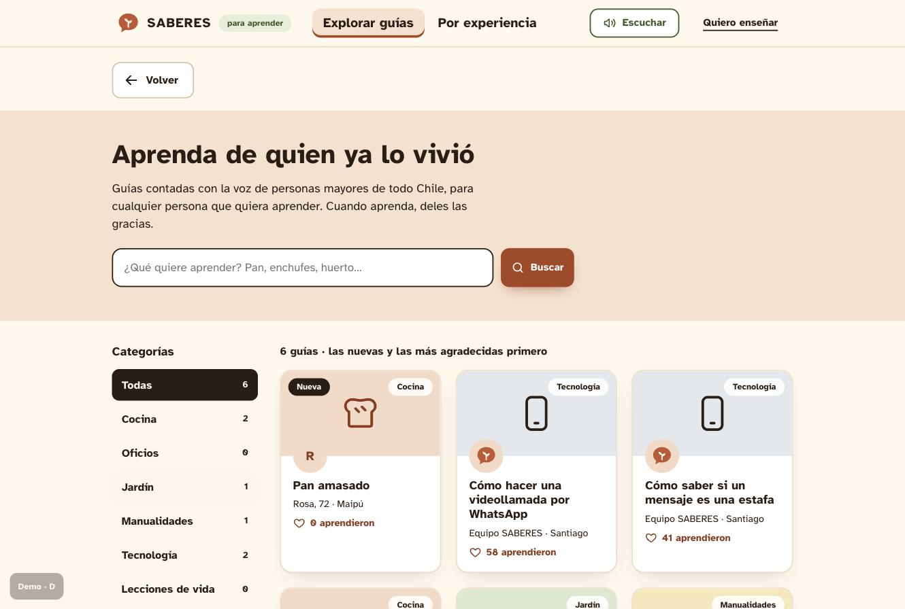
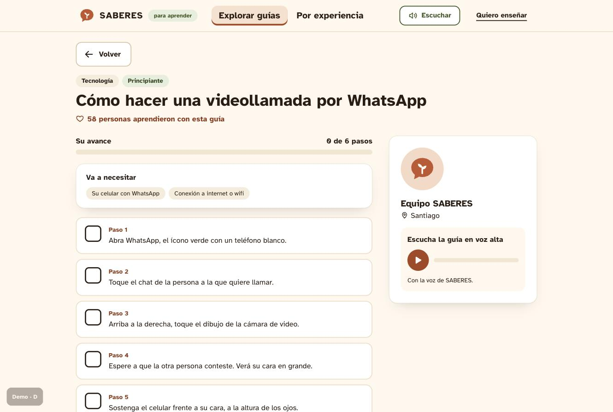

# SABERES 🎓🎙️

**Aprenda, enseñe y deje su huella.**
Una enciclopedia por voz donde las personas de 50+ **aprenden paso a paso con una IA paciente**, **enseñan lo que saben solo hablando** y los jóvenes **aprenden de ellas**.

Proyecto desarrollado en **Hack4Seniors UDD 2026** (1 de octubre, La Nave – Plaza_i, Universidad del Desarrollo).
Eje: **Vida diaria de la persona mayor**: autonomía, propósito y relación con los demás.

---

## 🧭 El problema

Las personas de 50+ en Chile **quieren aprender, pero nadie tiene tiempo ni paciencia para enseñarles**. Al mismo tiempo, **lo que ellas saben no tiene dónde quedar**, y muchas se sienten solas y sin un rol.

| Qué pasa | El dato |
|---|---|
| El país envejece rápido | El **14%** de la población tiene 65+ y ya hay **79 personas de 65+ por cada 100 menores de 15** (Censo 2024) |
| Quieren aprender | El **82%** de las personas de 60+ quiere desarrollar más habilidades digitales y el **66%** se siente obligado a aprender tecnología para no quedar excluido |
| Pero no logran hacerlo solas | El **88%** tiene internet en casa, pero solo el **42%** lo usa y apenas el **17%** hace trámites digitales de forma independiente |
| Casi nadie les enseña | Solo el **5%** ha recibido capacitación digital formal |
| Se sienten solas | El **49,2%** siente soledad no deseada y el **32%** no tiene ni un amigo |
| Quieren seguir siendo útiles | El **49%** de las personas mayores que trabaja lo hace por bienestar o para mantenerse activa |

> *"Conectar no es incluir. La inclusión comienza cuando alguien puede usar la tecnología para tomar decisiones de manera autónoma."* — Paulina Núñez, presidenta del Senado

---

## 💡 La solución

Todo se usa **hablando**, incluso el registro.

| Parte | Qué hace |
|---|---|
| **🗣️ Registro por voz** | La app pregunta nombre, comuna, a qué se dedicó, qué soñaba, qué sabe enseñar y una palabra clave, y arma el perfil sin que la persona teclee nada. |
| **🎓 Aprendo** | La persona pide una guía hablando y la IA la da **paso a paso**: espera a que diga *"listo"* y entiende *"repita"*, *"más lento"* y *"no entendí"*. |
| **🎙️ Enseño** | La persona explica algo hablando o escribiendo, como si se lo contara a un nieto, y la IA lo convierte en una **guía ordenada** (materiales, pasos, consejos y advertencias) que se publica con su nombre. Si el dictado tiene errores o muletillas, la IA los corrige en silencio. |
| **🤝 Conecto** | Los jóvenes buscan guías y aprenden de quien sabe. Al terminar dan las gracias y **al autor le llega un WhatsApp**: *"Tomás aprendió su pan amasado gracias a usted"*. |

**Por qué es preventiva:** da **propósito**, mantiene la **mente activa**, crea **vínculos entre generaciones** y aumenta la **autonomía**.

---

## 🎬 Demo

1. **Registro por voz:** la "señora Rosa" responde 4 preguntas hablando y la app le lee su perfil.
2. **Enseñar:** Rosa explica en 40 segundos cómo hace sopaipillas y aparece la guía ordenada con su nombre.
3. **Aprender:** un joven sigue esa guía paso a paso; dice *"no entendí"* y la IA se lo explica de otra forma.
4. **El gracias:** el joven toca *"¡Aprendí!"* y el celular de Rosa recibe el mensaje.

> En el paso 3 hay que abrir **la guía nueva de Rosa** (la que parte en 0, marcada *Nueva* y primera en la lista): el WhatsApp sale en los hitos 1, 10, 50 y 100.

| Bienvenida | Explorar guías | Guía paso a paso |
|---|---|---|
|  |  |  |

> 🎥 Video de la demo: _[agregar link]_

---

## 🏗️ Arquitectura

```
[Vista personas mayores]  ─┐                       Supabase
  voz + botones gigantes   │              ┌───────────────────────────────┐
                           ├─ /api/* ──►  │ Edge Function "api"           │ ──► Mistral Medium (IA)
[Vista jóvenes]           ─┘  (server.js  │  registro · entrar · guias    │      solo ordena y explica
  buscar, aprender, gracias    reenvía)   │  buscar · ayuda · ensenar     │ ──► OpenRouter (respaldo)
                                          │  descartar · aprendi          │
                                          │            │                  │ ──► Zavu: WhatsApp al autor
                                          │  Postgres: usuarios · guias   │      (Telegram de respaldo)
                                          └───────────────────────────────┘
```

| Componente | Tecnología |
|---|---|
| Frontend | HTML, CSS y JavaScript; Web Speech API (voz a texto y texto a voz) |
| Backend | **Supabase Edge Function** (Deno) en `supabase/functions/api` |
| Datos | **Supabase Postgres**: tablas `usuarios` y `guias`, con RLS (solo la función entra) |
| IA | **Mistral Medium 3.5** (`mistral-medium-2604`), con respaldo automático en **OpenRouter** |
| Voz | **Mistral Voxtral TTS** (`voxtral-mini-tts-2603`) con una voz chilena clonada (`/api/voz`); si falla, la del navegador |
| Mensajería | **Zavu** (WhatsApp) y Telegram como respaldo; solo en hitos (1, 10, 50, 100…) |
| Servidor local | `server.js` (Express): sirve la página y reenvía `/api/*` a Supabase |

### La IA hace solo dos cosas

| Ruta | Qué hace la IA |
|---|---|
| `/api/ensenar` | **Ordena** el relato (voz o texto) en una guía. Corrige errores del dictado y muletillas sin avisar, no inventa pasos, cantidades ni consejos, y marca los temas delicados para revisión. |
| `/api/ayuda` | **Explica** un paso cuando alguien dice "no entendí" o pregunta algo, usando **solo** la guía guardada en la base. |

Registro, entrar, buscar y "¡Aprendí!" funcionan sin IA. Si la IA falla, cada ruta tiene un respaldo, y si el backend no responde en 10 s, la página pasa al modo simulado (`mock.js`).

---

## 🚀 Cómo correrlo

### Requisitos
- Node.js 20 o superior
- Google Chrome (para voz y reconocimiento de voz)

### Ejecutar

```bash
git clone https://github.com/restry12/Caravean.git
cd Caravean
npm install
npm start
```

Abre **http://localhost:3000** en Chrome y toca "Empezar" (el navegador necesita un clic para permitir el audio).
El backend ya está en Supabase: **no hace falta configurar llaves para probar**. Cuenta de demo: **Rosa**, palabra clave **clavel**.

> Hay que entrar por `npm start`: si se abre `index.html` directo, la página no llega al backend y usa el modo simulado.
> Para probar sin backend: **http://localhost:3000/?mock=1**

### Llaves (solo en Supabase)

Las llaves van en **Supabase → Edge Functions → Secrets**, nunca en el repo:

| Secreto | Para qué |
|---|---|
| `MISTRAL_API_KEY` | La IA (ordenar y explicar) |
| `OPENROUTER_API_KEY` | Respaldo de la IA (opcional) |
| `ZAVUDEV_API_KEY`, `NUMERO_DEMO` | El WhatsApp de "gracias" |
| `TELEGRAM_TOKEN`, `TELEGRAM_CHAT_ID` | Respaldo del aviso (opcional) |

En local, `.env` (copia de `.env.example`) solo se usa para `npm run probar-ia`.

### Herramientas para el equipo

```bash
npm run probar-ia   # prueba los prompts de la IA contra Mistral real
```

Para dejar la demo como al principio, en el SQL Editor de Supabase:

```sql
select public.reiniciar_demo();
```

---

## 📱 Crear un curso por WhatsApp

Una persona mayor crea un curso **solo con WhatsApp**: manda el nombre del curso como texto y después un audio o video explicando. SABERES lo transcribe (Mistral Voxtral), lo ordena en pasos (el mismo `estructurarGuia` de `/api/ensenar`), lo publica y le responde con el link `URL_PUBLICA/?guia=<id>`.

1. Corra el servidor: `npm start`.
2. Abra un túnel público: `npx cloudflared tunnel --url http://localhost:3000`.
3. En el panel de Zavu → **Webhooks** → evento `message.inbound`, pegue `https://TU-URL/webhooks/zavu`.
4. Copie el secreto del webhook a `.env` como `ZAVU_WEBHOOK_SECRET=` y ponga `URL_PUBLICA=https://TU-URL`. Reinicie `npm start`.
5. Desde el celular, escriba al número de Zavu el nombre del curso y luego mande un audio o video.

> ⚠️ Sin `ZAVU_WEBHOOK_SECRET` el webhook acepta cualquier mensaje (modo demo). Póngalo antes de compartir la URL del túnel.

- **Dónde se guarda:** con `SUPABASE_SERVICE_ROLE_KEY` en `.env`, en Supabase (tabla `guias`). Sin ella, en `data/guias.json` y el servidor local la suma a `GET /api/guias`.
- **Archivos:** en `public/media/` (no se suben a git). Necesita `ffmpeg-static` (ya viene en `npm install`).
- **Plan B sin WhatsApp:** en la pantalla Enseñar, «Subir un audio o video» usa `POST /api/subir-curso` (multipart: `archivo`, `titulo`, `autor`), con el mismo proceso. `?mock=1` evita Voxtral y usa una transcripción de demo.
- **Probar sin WhatsApp:** `scripts/probar-webhook.sh` manda un texto y un audio falsos a `localhost:3000/webhooks/zavu` y espera la guía nueva. En macOS graba el audio de prueba con `say`; en otro sistema, `MEDIA_URL_PRUEBA=https://…/audio.mp3 scripts/probar-webhook.sh`.
- La web muestra los cursos nuevos sola: Explorar y la portada revisan `/api/guias` cada 5 s y avisan «¡Nuevo curso!».

## 📁 Estructura

```
Caravean/
├─ server.js                    # sirve la página y reenvía /api/* a Supabase
├─ public/
│  ├─ index.html                # vistas para personas mayores y jóvenes
│  ├─ estilos.css
│  ├─ app.js                    # pantallas, voz, registro, guía paso a paso, enseñar
│  ├─ dibujos.js                # íconos, retratos e ilustraciones
│  └─ mock.js                   # modo simulado (respaldo si el backend no responde)
├─ supabase/
│  ├─ functions/api/
│  │  ├─ index.ts               # rutas /api/*
│  │  ├─ ia.js                  # IA: ordenar y explicar (Mistral + OpenRouter)
│  │  └─ avisos.js              # "gracias" por WhatsApp en hitos (Zavu + Telegram)
│  ├─ migrations/               # tablas, funciones y RLS
│  └─ seed.sql                  # 5 guías precargadas y la cuenta de Rosa
└─ scripts/
   ├─ probar-ia.js              # pruebas de los prompts
   └─ guias-ejemplo.json
docs/
├─ plan-completo-saberes.pdf
└─ capturas/                    # pantallas para el README y las slides
```

---

## ♿ Accesibilidad

- Letra de 28 px o más y botones de 84 px en la vista para personas mayores.
- Voz y texto siempre juntos: todo lo que la app dice aparece como subtítulo.
- Un paso a la vez, sin límites de tiempo que apuren.
- Si el micrófono falla, siempre aparece un campo para escribir.

## 🔒 Seguridad

- La IA **no inventa pasos**: ordena lo que la persona dijo. Si un paso trae un número que la persona no dijo, se descarta.
- Ninguna guía puede llevar **teléfonos ni links** (el formato típico de las estafas), aunque vengan en el relato.
- Las guías sobre temas delicados (electricidad, gas, salud, remedios) llevan advertencias y quedan **en revisión** antes de publicarse.
- Registro con nombre y palabra clave en el prototipo; la versión real sumaría verificación por celular.
- Las palabras clave nunca llegan al navegador por la API pública: las tablas tienen RLS y solo la Edge Function entra.
- Respaldo automático: si Mistral falla responde OpenRouter; si no hay IA, cada ruta tiene un respaldo; y si el backend no responde, la página usa `mock.js`.

> ⚠️ Prototipo de hackatón con datos y autores ficticios.

---

## 🗺️ Próximos pasos

- [ ] Piloto con un club de adulto mayor y una universidad (vinculación con el medio)
- [ ] Clases por videollamada entre autores y jóvenes
- [ ] Moderación comunitaria de guías
- [ ] App móvil y versión para parlantes inteligentes

---

## 👥 Equipo

| Nombre | Rol |
|---|---|
| _[Nombre]_ | P1 – Interfaz |
| _[Nombre]_ | P2 – IA y backend |
| _[Nombre]_ | P3 – Integraciones |
| _[Nombre]_ | P4 – Pitch y contenido |

---

## 📚 Fuentes

- [Censo 2024 – Forbes Chile](https://forbes.cl/actualidad/2025-03-27/sigue-en-aumento-el-envejecimiento-poblacional-en-chile-mayores-de-65-anos-alcanzaron-el-14-en-2024)
- [Radiografía Digital Senior Tech, ClaroVTR y Criteria (2024)](https://www.gerontologia.org/chile-personas-mayores-66-se-ha-sentido-presionada-por-adoptar-nuevas-tecnologias/)
- [Infogate – Brecha digital en adultos mayores persiste pese a mayor acceso (2026)](https://infogate.cl/2026/04/brecha-digital-en-adultos-mayores-persiste-pese-a-mayor-acceso/)
- [El Mostrador – Brecha digital en Chile (2025)](https://www.elmostrador.cl/agenda-pais/agenda-digital/2025/09/24/brecha-digital-en-chile-el-desafio-de-los-adultos-mayores-en-la-era-tecnologica/)
- [UC – Soledad no deseada (2025)](https://www.uc.cl/noticias/soledad-no-deseada-casi-la-mitad-de-la-poblacion-mayor-declara-sentirse-en-soledad/)
- [UC – El 32% de los adultos mayores no tiene amigos](https://www.uc.cl/academia-en-los-medios/el-32-de-los-adultos-mayores-en-chile-no-tienen-amigos/)
- [ASIMET / Cipem – Motivos para trabajar de las personas mayores](https://www.asimet.cl/estudio-27-de-los-adultos-mayores-trabaja-porque-sus-pensiones-son-bajas/)
- [La Tercera – Inclusión digital de las personas mayores](https://www.latercera.com/tendencias/noticia/como-incluir-a-las-personas-mayores-en-un-estado-cada-vez-mas-digitalizado-el-desafio-que-enfrenta-chile/)

### Créditos de la voz

La voz de SABERES se clonó con Mistral Voxtral a partir de grabaciones del
[Crowdsourced high-quality Chilean Spanish speech data set](https://www.openslr.org/71/) (OpenSLR 71),
© Google, Inc., licencia [CC BY-SA 4.0](https://creativecommons.org/licenses/by-sa/4.0/). Hablante `clf_04310`.

---

Hecho con ❤️ en Hack4Seniors UDD 2026.
